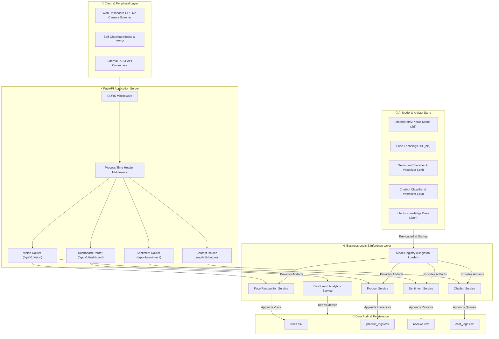
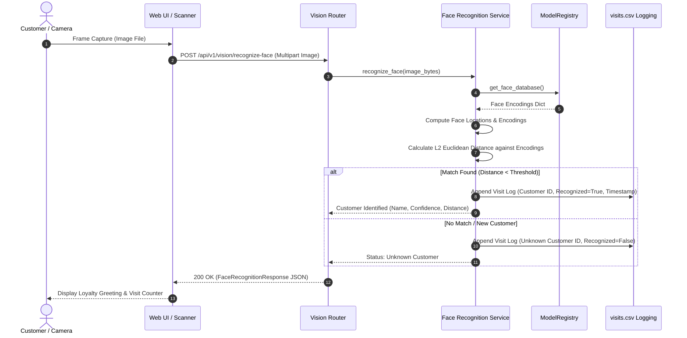
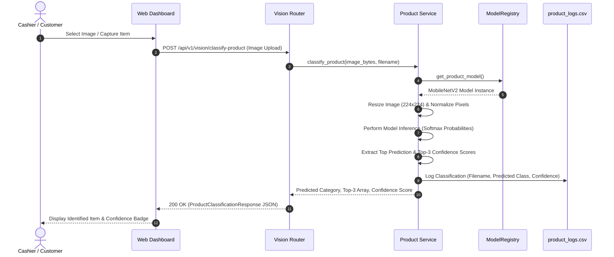
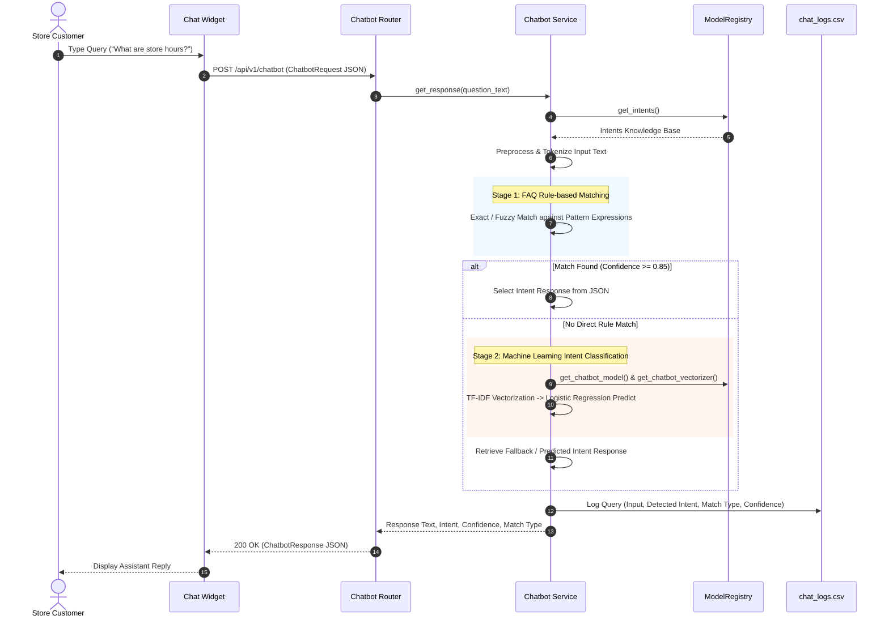

#  Smart Retail AI Platform

[](https://www.python.org/)
[](https://fastapi.tiangolo.com/)
[](https://www.tensorflow.org/)
[](https://scikit-learn.org/)
[](https://www.docker.com/)
[](LICENSE)

An enterprise-grade, production-ready **Smart Retail & Customer Intelligence AI API Platform**. Powered by FastAPI, TensorFlow MobileNetV2, TF-IDF NLP models, OpenCV Face Recognition encodings, and a real-time responsive analytics dashboard UI.

---

##  Table of Contents
1. [Overview](#-overview)
2. [Key Capabilities](#-key-capabilities)
3. [System Architecture](#-system-architecture)
4. [Sequence Diagrams](#-sequence-diagrams)
   - [Customer Loyalty & Face Recognition Flow](#1-customer-loyalty--face-recognition-flow)
   - [Product Classification Flow](#2-product-classification-flow)
   - [Hybrid Chatbot & Intent Matching Flow](#3-hybrid-chatbot--intent-matching-flow)
5. [Repository Structure](#-repository-structure)
6. [AI Models & Pipeline Architecture](#-ai-models--pipeline-architecture)
7. [API Endpoints Reference](#-api-endpoints-reference)
8. [Installation & Setup](#-installation--setup)
9. [Docker Deployment](#-docker-deployment)
10. [Web Analytics UI & Live Scanner](#-web-analytics-ui--live-scanner)
11. [Logging & Data Persistence](#-logging--data-persistence)

---

##  Overview

The **Smart Retail AI Platform** bridges offline retail environments with cloud-native artificial intelligence. It converts physical store interactions—such as foot traffic, product pickup, customer loyalty check-in, and feedback—into actionable real-time business metrics.

### Primary Use Cases
* **Automated Product Recognition**: Instant item classification at self-checkout kiosks or smart shelves.
* **V.I.P & Loyalty Identification**: Non-intrusive customer recognition with visit counter tracking.
* **Customer Sentiment Intelligence**: Automated feedback classification (positive, neutral, negative) with TF-IDF NLP.
* **Conversational Shopping Assistant**: Hybrid FAQ matching and intent-driven AI assistant for store navigation and policies.
* **Executive Retail Analytics**: Integrated live dashboard tracking visitors, sentiment ratios, intent frequencies, and audit logs.

---

##  Key Capabilities

* **Computer Vision Product Classification**: Deep learning inference using MobileNetV2 for fast top-N product predictions.
* **Face Recognition & Loyalty System**: Feature vector extraction & L2 distance comparison against pickled customer facial database (`face_db.pkl`).
* **NLP Sentiment Analysis**: Clean text preprocessing, NLTK tokenization/lemmatization, TF-IDF vectorization, and Logistic Regression classification.
* **Hybrid Intelligent Chatbot**: Dual-stage query handling (exact/fuzzy rule matching + trained ML intent classifier fallback).
* **Singleton Model Registry Pattern**: Zero-latency runtime inference with pre-loaded models in memory during application boot.
* **Embedded Analytics UI**: Built-in responsive HTML5/CSS3/Vanilla JS web dashboard accessible directly via FastAPI static file serving.

---

##  System Architecture



---

##  Sequence Diagrams

### 1. Customer Loyalty & Face Recognition Flow



### 2. Product Classification Flow



### 3. Hybrid Chatbot & Intent Matching Flow



---

##  Repository Structure

```text
.
├── app/                        # FastAPI Core Backend Package
│   ├── main.py                 # Application Lifespan Handler, CORS, & Entrypoint
│   ├── routers/                # API Endpoints & Request Routing
│   │   ├── vision.py           # Product Classification & Face Recognition Endpoints
│   │   ├── sentiment.py        # Customer Review Sentiment Analysis Endpoints
│   │   ├── chatbot.py          # Conversational Assistant Endpoints
│   │   └── dashboard.py        # Real-time Metrics & Log Inspection Endpoints
│   ├── schemas/                # Data Validation Schemas (Pydantic V2)
│   │   ├── request.py          # Input Data Models
│   │   └── response.py         # Standardized API Response Models
│   ├── services/               # Core Business Logic & AI Pipelines
│   │   ├── pipeline.py         # ModelRegistry Singleton (Model Loading & Memory Management)
│   │   ├── product_service.py  # Image Processing & MobileNetV2 Classifier Pipeline
│   │   ├── face_service.py     # OpenCV Encoding Extraction & Loyalty Tracking
│   │   ├── sentiment_service.py# NLP Preprocessing, TF-IDF, & Sentiment Inference
│   │   ├── chatbot_service.py  # Hybrid Rule + ML Intent Matching Pipeline
│   │   └── dashboard_service.py# Aggregated Analytics & CSV Data Parsing Service
│   ├── static/                 # Embedded Web UI & Frontend Assets
│   │   ├── index.html          # Single Page Web Dashboard UI
│   │   ├── style.css           # Premium Dark Mode Design System
│   │   └── app.js             # Client-side Logic, Camera Handler, API Integration
│   ├── logs/                   # Data Audit Logs (CSV Files)
│   │   ├── visits.csv          # Face Recognition Visit Audit Trail
│   │   ├── product_logs.csv    # Product Classification Audit Trail
│   │   ├── reviews.csv         # Customer Review Sentiment Audit Trail
│   │   └── chat_logs.csv       # Chatbot Query Audit Trail
│   ├── middleware/             # API Key Security & Request Interceptors
│   └── utils/                  # Application Configurations & Settings
├── models/                     # Trained Machine Learning Model Artifacts
│   ├── product_classifier.h5   # Keras MobileNetV2 Product Classifier Model
│   ├── face_db.pkl             # Customer Face Vector Database
│   ├── sentiment_model.pkl     # Sentiment Logistic Regression Classifier
│   ├── sentiment_vectorizer.pkl# Sentiment TF-IDF Vectorizer
│   ├── chatbot_model.pkl       # Chatbot Intent Classifier
│   ├── chatbot_vectorizer.pkl  # Chatbot TF-IDF Vectorizer
│   └── intents.json            # Customer Knowledge Base & Intent Patterns
├── Data/                       # Datasets & Historical Data Files
├── Notebooks/                  # Machine Learning Training & Evaluation Notebooks
├── requirements.txt            # Python Dependencies
├── .gitignore                  # Git Exclusion Definitions
└── README.md                   # Platform Documentation
```

---

##  AI Models & Pipeline Architecture

The platform embeds **7 Machine Learning Model Artifacts**, loaded seamlessly via the singleton `ModelRegistry` pattern:

| Model Name | Artifact File | Technique / Architecture | Task Description |
| :--- | :--- | :--- | :--- |
| **Product Classifier** | `product_classifier.h5` | MobileNetV2 Transfer Learning | Categorizes uploaded item images into retail inventory classes |
| **Face Database** | `face_db.pkl` | OpenCV / 128D Face Vector Encodings | Recognizes registered customer faces and tracks store visits |
| **Sentiment Model** | `sentiment_model.pkl` | Logistic Regression | Classifies cleaned review text into Positive, Neutral, or Negative |
| **Sentiment Vectorizer** | `sentiment_vectorizer.pkl` | TF-IDF (Term Frequency-Inverse Doc Frequency) | Converts raw text into numerical feature matrices |
| **Chatbot Model** | `chatbot_model.pkl` | Multinomial Classifier | Intent classification fallback for complex conversational queries |
| **Chatbot Vectorizer** | `chatbot_vectorizer.pkl` | TF-IDF Vectorizer | N-gram feature extraction for query intent classification |
| **Intents Knowledge Base** | `intents.json` | Structured Intent & Pattern Dataset | FAQ patterns, responses, and intent categories |

---

##  API Endpoints Reference

### Vision Endpoints (`/api/v1/vision`)

* `POST /api/v1/vision/classify-product`
  * **Summary**: Classify retail product from image.
  * **Payload**: `Multipart/form-data` with `file` (image).
  * **Response**: `ProductClassificationResponse` (Predicted category, confidence, top-3 array).

* `POST /api/v1/vision/recognize-face`
  * **Summary**: Customer recognition and loyalty check-in.
  * **Payload**: `Multipart/form-data` with `file` (image).
  * **Response**: `FaceRecognitionResponse` (Customer ID, status, confidence score, distance).

* `POST /api/v1/vision/register-face`
  * **Summary**: Register new customer face profile.
  * **Payload**: Form data with `customer_name` and `file` (image).
  * **Response**: `BaseResponse` (Status message).

### Sentiment Analysis Endpoints (`/api/v1`)

* `POST /api/v1/analyze-sentiment`
  * **Summary**: Analyze customer review text.
  * **Payload**: `JSON` `{"text": "Great store experience and fast service!"}`.
  * **Response**: `SentimentAnalysisResponse` (Sentiment label, confidence score, cleaned text).

### Conversational Chatbot Endpoints (`/api/v1`)

* `POST /api/v1/chatbot`
  * **Summary**: Customer service assistant query.
  * **Payload**: `JSON` `{"question": "What is the return policy?"}`.
  * **Response**: `ChatbotResponse` (Generated response, detected intent, confidence score, match type).

### Retail Analytics Dashboard Endpoints (`/api/v1/dashboard`)

* `GET /api/v1/dashboard/stats`
  * **Summary**: Real-time aggregated dashboard KPIs.
  * **Response**: `DashboardStatsResponse` (Total visitors, return rate %, review breakdowns, top intents).

* `GET /api/v1/dashboard/details?category={category}`
  * **Summary**: Drill-down inspection of raw audit log records.
  * **Query Params**: `category` (`visitors`, `returning`, `reviews`, `positive_reviews`, `intent`, `product`).

### System Health

* `GET /health`
  * **Summary**: System operational state and model memory load check.

---

##  Installation & Setup

### Prerequisites
* Python 3.11 or higher
* `pip` package manager

### 1. Clone & Set Up Environment
```bash
# Navigate to workspace directory
cd "AI Smart Retail System"

# Create virtual environment
python -m venv .venv

# Activate virtual environment
# Windows (PowerShell):
.\.venv\Scripts\Activate.ps1
# Linux/macOS:
source .venv/bin/activate
```

### 2. Install Dependencies
```bash
pip install -r requirements.txt
```

### 3. Launch Local FastAPI Server
```bash
uvicorn app.main:app --host 0.0.0.0 --port 8000 --reload
```

---

##  Docker Deployment

### Run via Docker Container
```bash
# Build Docker image
docker build -t smart-retail-ai-platform:latest .

# Run Docker container
docker run -d -p 8000:8000 --name smart_retail_app smart-retail-ai-platform:latest
```

### Run via Docker Compose
```bash
# Launch containers in background
docker-compose up -d --build
```

---

##  Web Analytics UI & Live Scanner

The platform includes a built-in interactive dashboard served directly at `http://localhost:8000/`:

* **Live Web Cam Scanner**: Capture products or customer faces directly from browser video feed.
* **Sentiment Analyzer Tool**: Interactive text evaluation sandbox.
* **Conversational AI Assistant**: Floating customer support chat widget.
* **Live Retail Metrics**: Real-time counters for foot traffic, loyalty return rates, and feedback distribution.

---

##  Data Persistence & Audit Logs

All AI predictions and system interactions are logged into CSV files under `app/logs/`:
* `visits.csv`: Records timestamps, customer IDs, recognition status, and confidence scores.
* `product_logs.csv`: Logs image filenames, detected categories, and model confidence.
* `reviews.csv`: Stores raw customer reviews, cleaned text, and assigned sentiment classifications.
* `chat_logs.csv`: Logs customer queries, matched intents, match types (`rule_exact`, `rule_fuzzy`, `ml_classifier`), and responses.

---

##  License

Distributed under the **MIT License**. See `LICENSE` for more information.

